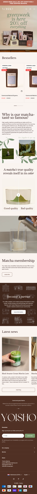
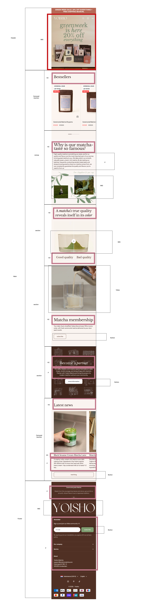
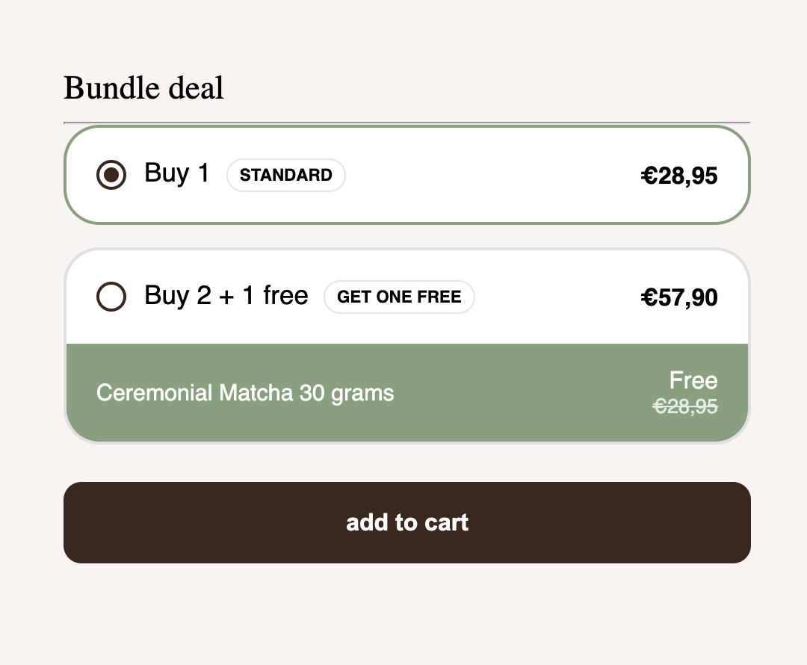
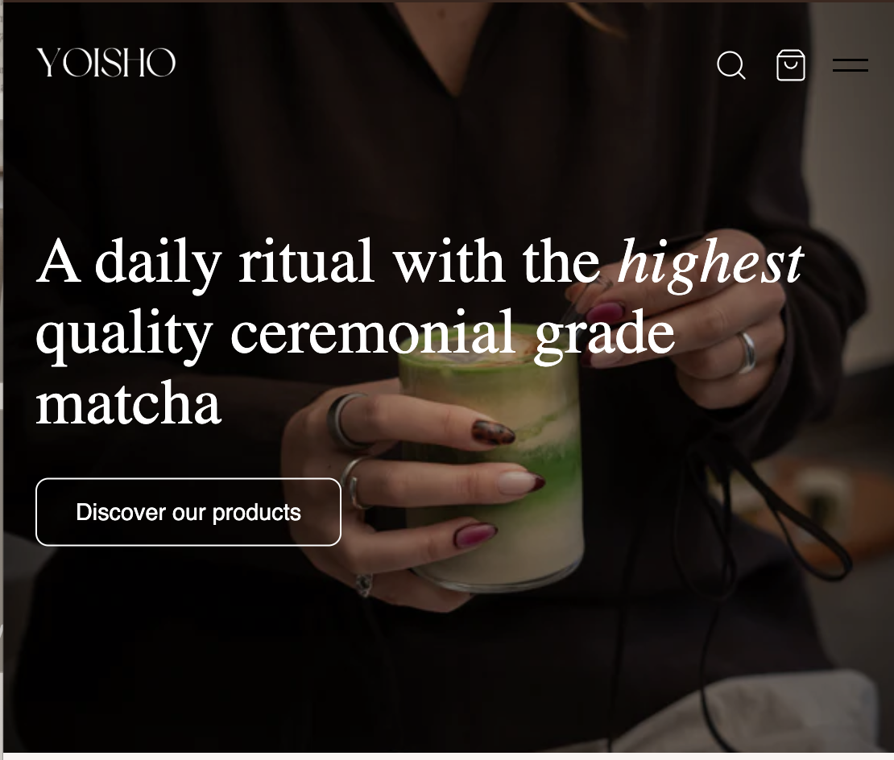

# Procesverslag
Markdown is een simpele manier om HTML te schrijven.  
Markdown cheat cheet: [Hulp bij het schrijven van Markdown](https://github.com/adam-p/markdown-here/wiki/Markdown-Cheatsheet).

Nb. De standaardstructuur en de spartaanse opmaak van de README.md zijn helemaal prima. Het gaat om de inhoud van je procesverslag. Besteedt de tijd voor pracht en praal aan je website.

Nb. Door *open* toe te voegen aan een *details* element kun je deze standaard open zetten. Fijn om dat steeds voor de relevante stuk(ken) te doen.

## Jij

  
uitwerken voor kick-off werkgroep

  ### Auteur:
  Marie Janette Haspels

  #### Je startniveau:
  Blauw

  #### Je focus:
   responsive 
 

## Je website

  
uitwerken voor kick-off werkgroep

  ### Je opdracht:
 Yoisho (is een website waar je matcha kan kopen)

  #### Screenshot(s) van de eerste pagina (small screen): 
  home pagina (Yoisho)  
  
  

  #### Screenshot(s) van de tweede pagina (small screen):
  Blog pagina
  
  
 

## Toegankelijkheidstest 1/2 (week 1)

  
uitwerken na test in 2e werkgroep

  ### Bevindingen
  Lijst met je bevindingen die in de test naar voren kwamen: 
  - spasmes apparaat
  - Twee brillen
  - Baut website: De website is best wel oke gedaan qua toegangelijkheid. wat ik wel mis is dat er als er plaatjes zijn dat die niet worden genoemd. Er word ook gezegt dat als er een link of knop is dat je daarop kon drukken (link). de knop EN doet het wel alleen het blijft op NL staan. Je kan ook niet terug naar de home screen.
  - Ik heb uiteindelijke gekozen voor een andere website, omdat die makkelijker is qua indeling en hoe het er uit zien. en genoeg variaties.

## Breakdownschets (week 1)

  
uitwerken na afloop 3e werkgroep

  ### de hele pagina: 
  

   
  

  ### dynamisch deel (bijv menu): 

  ### wellicht nog een dynamisch deel (bijv filter): 
  

## Voortgang 1 (week 2)

  
uitwerken voor 1e voortgang

  ### Stand van zaken
  hier dit ging goed & dit was lastig (neem ook screenshots op van delen van je website en code)

  ### Agenda voor meeting
  samen met je groepje opstellen

  --

  ### Verslag van meeting
  hier na afloop snel de uitkomsten van de meeting vastleggen

  -  ik moest een andere pagina kiezen, de pagina die ik eerst wilde doen zat geen variatie.
  - verder was de uitgekozen website goed.
  - nog een punt
  - ...

## Voortgang 2 (week 3)

  
uitwerken voor 2e voortgang

  ### Stand van zaken
het lukt mij niet op de hamburger menu goed te maken.

  ### Agenda voor meeting
  samen met je groepje opstellen
- Hoe maak ik een hamburger menu? hebhetvia codepen gedaan alleen het werkt nog steeds niet.
- Ik weet niet waar ik moet beginnen. met de webiste (erg veel moeite mee)
   Foto, moeten mobile worden.

  ### Verslag van meeting
  hier na afloop snel de uitkomsten van de meeting vastleggen

  - We Hebben samen gekeken naar de Menu balk, ik had eindelijk een in javascript code nog niet weg gehaald. dus het gelukkig gelukt.
  - En ook gekeken naar de foto's. Welke formaat het nodig is en hoe ik het beste het kan doen.
  - Verder gevraagd naar toe ik het beste hamburgermenu kan stijlen met een achtergrond en tekst. 

## Toegankelijkheidstest 2/2 (week 4)

  
uitwerken na test in 9e werkgroep

  ### Bevindingen
  Lijst met je bevindingen die in de test naar voren kwamen (geef ook aan wat er verbeterd is):

## Voortgang 3 (week 4)

  
uitwerken voor 3e voortgang

  ### Stand van zaken
  hier dit ging goed & dit was lastig (neem ook screenshots op van delen van je website en code)
  ik vinde coderen erg lastig. vin eerlijk gezegt ook echt niet mijn vak. ik heb het geprobeerd. opzich wel een beetje troys dat het wel responive is voor de telefoon.
  maar dingen moet wel anders. maar dat lukte niet mee.

  ### Agenda voor meeting
  samen met je groepje opstellen

  ### Verslag van meeting
  hier na afloop snel de uitkomsten van de meeting vastleggen

  - meeting niet gedaan, hoefde niet perse te komen. (het was online)

## Eindgesprek (week 5)

  
uitwerken voor eindgesprek

  ### Je uitkomst - karakteristiek screenshots:
  

  ### Dit ging goed/Heb ik geleerd: 
  Korte omschrijving met plaatjes

  

  ### Dit was lastig/Is niet gelukt:
  Korte omschrijving met plaatjes
  bij de echte site heb je aan de rechter kant de hamburger en winkelmandje alleen die zijn wit. maar op de product pagin azijn de bruin. dat lukte niet op het te veranderen.
  daardoor zou het meer toegangelijk zijn. en hoe als je op add to cart drukt dat hij dan in je winkel staat.

  

## Bronnenlijst

  
continu bijhouden terwijl je werkt

  Nb. Wees specifiek ('css-tricks' als bron is bijv. niet specifiek genoeg). 
  Nb. ChatGpT en andere AI horen er ook bij.
  Nb. Vermeld de bronnen ook in je code.

  1. https://lucide.dev/ voor icoontjes
  2. https://developer.mozilla.org/ hamburgermenu (de meeste dingen komen hier vandaan)
  3. https://assets.codepen.io/274456/ui-icon-hamburger.svg

